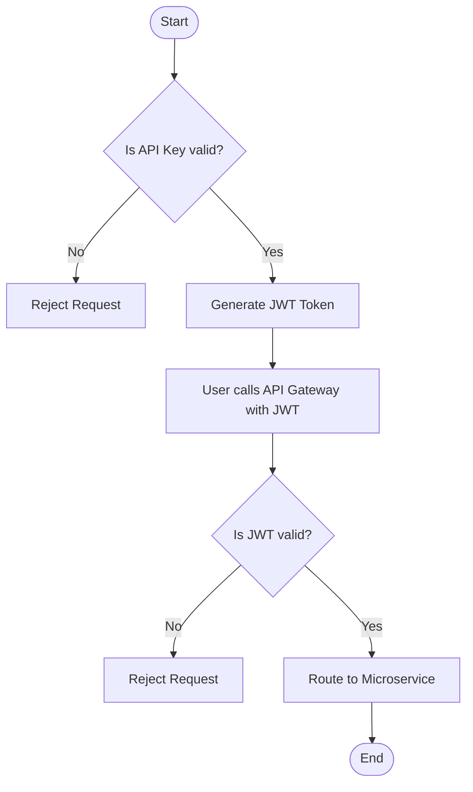

# 🚪 ApiGateway

ApiGateway is a **.NET 8** project that serves as an API Gateway using [Ocelot](https://ocelot.readthedocs.io/), with integrated **JWT authentication** and **Swagger documentation aggregation**.  
It routes and secures API requests, providing a unified entry point for downstream services and aggregates Swagger endpoints for easier API exploration.

## ⚡ To access this gateway:
1. Get the Static Api Key from the Frontend
2. Use the Api Key https://github.com/VentixeEventManagement/JwtAuthProvider on the JWT Token Provider to get a JWT Token
3. Use that Token in swagger by pasting in just the token value or as a header with the Bearer Prefix
4. The other microservices are avaliable to be access directly though in the future should be isolated on a private network(azure) and only allow access from the gateway endpoint.



---

## ✨ Features

- 🚦 **API Gateway** using ASP.NET Core & Ocelot
- 🔐 **JWT-based Authentication & Authorization** for secure access
- 📚 **Aggregated Swagger UI** for all downstream services (via [SwaggerForOcelot](https://github.com/Burgyn/MMLib.SwaggerForOcelot))
- 🛣️ **Customizable Routing** via `ocelot.json`
- 🧩 **Extensible Architecture** (custom interceptors & repositories)

---

## ⚡ Getting Started

1. **Clone** the repository:
   ```shell
   git clone <repo-url>
   ```

2. **Configure** environment variables and update `appsettings.json` and `ocelot.json` for your environment and downstream services.

3. **Restore NuGet packages** and **build**:
   - Using Visual Studio 2022 **or**
   - With the .NET CLI:
     ```shell
     dotnet restore
     dotnet build
     ```

4. **Run** the project:
   - By default, the gateway is accessible at [`/gateway`](http://localhost:YOUR_PORT/gateway)

5. **Access Swagger UI**:
   - Browse to [`/gateway/swagger`](http://localhost:YOUR_PORT/gateway/swagger) to explore and test the aggregated APIs.

---

## 🗂️ Project Structure

```
ApiGateway/
├── Controllers/            # API controllers for gateway operations
├── Repository/             # Interfaces & implementations for Swagger endpoint data
├── Security/               # JWT authentication services
├── Startup.cs              # Configures services, authentication, Swagger, Ocelot
├── Program.cs              # Application entry point
├── ocelot.json             # Ocelot routing & downstream services config
├── appsettings.json        # Application configuration
└── ApiGateway.Tests/       # Integration & unit tests
```

---

## 🧪 Testing

- Integration and unit tests are in the **ApiGateway.Tests** project.
- Use your preferred test runner:
  ```shell
  dotnet test
  ```
- Ensure all gateway features and routes function as expected.

---

## ⚙️ Requirements

- [.NET 8 SDK](https://dotnet.microsoft.com/download/dotnet/8.0)
- Visual Studio 2022 *(recommended)*
- Downstream services with **Swagger/OpenAPI** documentation

---

## 🙏 Acknowledgments

- Based on the [MMLib.SwaggerForOcelot Demo](https://github.com/Burgyn/MMLib.SwaggerForOcelot).
- Uses [Ocelot](https://ocelot.readthedocs.io/) for API Gateway features.

---

## 📝 License

This project is provided *as-is* for demonstration and educational purposes.  
Please review and update the license as appropriate for your use case.

---
